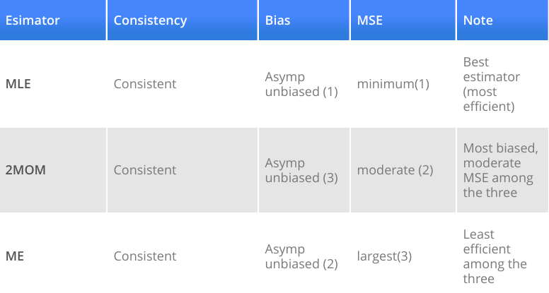

```{r setup, include=FALSE}
knitr::opts_chunk$set(echo = FALSE)
```

## Exponential Distribution

- The **exponential distribution** is the probability distribution that describes the time between events in a Poisson point process. 
- Exponential variables can be used to model situations where certain events occur with a constant probability per unit length, such as the distance between mutations on a DNA strand
- The probability density function (PDF) of an exponential distribution is given by $$f(x; \lambda) = \begin{cases}\lambda e^{-\lambda x} & x \geq 0 \\ 0 & x < 0 \end{cases}$$ where $\lambda > 0$ is the parameter of the distribution, often called the **rate parameter**

```{r, echo=FALSE, message=FALSE}
library(ggplot2)
library(plyr)
library(latex2exp)
library(gridExtra)
library(tidyr)
library(dplyr)
```

## Exponential PDF
```{r PDF}
theme_set(theme_bw())
exponential <- function(lambda, x) {
  data.frame(x = x, value = lambda * exp(-lambda * x))
}
params <- expand.grid(lambda = c(0.5, 1, 1.5, 2))
pdfs <- mdply(params, exponential, x = seq(0,4, length=250))
ggplot(pdfs, aes(x, value, color=factor(lambda))) +
  geom_path() + 
  ylab(TeX("$f(x; \\lambda) = \\lambda e^{-\\lambda x} $")) + 
  labs(color=TeX("$\\lambda$"))
```

- Basic Properties: $E[X] = \frac{1}{\lambda}$, $Var[X] = \frac{1}{\lambda^2}$ and $m[X] = \frac{\ln (2)}{\lambda}$ 

## Point Estimators of $\lambda$
- We use the following three point estimators:
    - Maximum Likelihood Estimator (MLE): $\hat{\lambda}_{MLE} = \frac{n}{\sum_{i=1}^{n} x_i} = \frac{1}{\bar{x}}$
    - Method of Moments Estimator (2nd Moment): $\hat{\lambda}_{2MOM}=\sqrt{\frac{2n}{\sum_{i=1}^{n} x_i^2}}$
    - Median as a function of $\lambda$ (ME): $\hat{\lambda}_{ME}=\frac{ln(2)}{m(X)}$

- We compare these estimators based on the following criteria: 
    - Bias: $Bias[\hat{\lambda}] = E[\hat{\lambda}] - \lambda$
    - Mean Squared Error (MSE): $MSE[\hat{\lambda}] = Var(\hat{\lambda}) + Bias(\hat{\lambda})^2$
    - Consistiency: $\lim\limits_{n \to \infty} \hat{\lambda}_n = \lambda$
    
##Bias and MSE
- MLE 
    - $Bias[\hat{\lambda}] = nE[\frac{1}{\sum_{i=1}^n x_i}] - \lambda = \frac{n \lambda}{n-1} - \lambda = \frac{\lambda}{n-1}$ 
        - Bias approaches 0 as $n \rightarrow \infty$
    - $Var(\hat{\lambda}) = \frac{1}{n * I_{exp}(\lambda)} = \frac{1}{n * -E[-\frac{1}{\lambda^2}]}  = \frac{\lambda^2}{n}$
    - $MSE[\hat{\lambda}] = \frac{\lambda^2}{n} + (\frac{\lambda}{n-1})^2$

Since there is no closed-form expression for the expectation and variance of $\hat{\lambda}_{2MOM}$  and  $\hat{\lambda}_{ME}$  in terms of $\lambda$, we will numerically evaluate:

- $Bias(\hat\lambda) = E(\hat\lambda) - \lambda$</font>
- $MSE(\hat\lambda)= Bias(\hat\lambda)^2 + Var(\hat\lambda)$

##Bias and MSE of Each Estimator
```{r echo=FALSE, warning=FALSE, comment=FALSE, message=FALSE, cache=TRUE}
n <- c(10, 100, 1000, 10000)
lambdas <- seq(0.01,5,by=0.2)
num_sims <- 1000


#MLE
  ##output a MLE bias list for each lambda input
biasMLEList<-function(lambda){
  MLEs <- matrix(data = NA, length(n), num_sims)
  for (i in 1:length(n)){
       for (j in 1:num_sims) {
        MLEs[[i,j]] <- 1/mean(rexp(n[i], lambda))
       }
  }
  ##the bias of the estimator= expected lambda hat - true lambda
  biasMLE<-matrix(apply(MLEs,1,mean)-lambda)
  return(biasMLE)
}

  ##output a MLE MSE list for each lambda input
mseMLEList<-function(lambda){
  MLEs <- matrix(data = NA, length(n), num_sims)
  for (i in 1:length(n)){
       for (j in 1:num_sims) {
        MLEs[[i,j]] <- 1/mean(rexp(n[i], lambda))
       }
  }
#the bias of the estimator= expected lambda hat - true lambda
  biasMLE<-matrix(apply(MLEs,1,mean)-lambda)
#the MSE of the estimator=  variance + bias^2
  mseMLE<-matrix(apply(MLEs,1,var)) + biasMLE^2
  return(mseMLE)
}


  ##calculate biases for all different true parameter lambda
biasMLE=matrix(nrow=length(n), ncol=length(lambdas))
for (i in 1:length(lambdas)){
  lam<-lambdas[i]
  biasMLE[,i]<-biasMLEList(lambda=lam)
}

biasMLE<-rbind(biasMLE,lambdas)
tbiasMLE<-t(biasMLE)
colnames(tbiasMLE)<-c(n,"lambda")

tbiasMLE_L <- gather(as.data.frame(tbiasMLE), sampleN, bias, "10":"10000", factor_key=TRUE)


  ##calculate MSE for all different true parameter lambda for MOM
mseMLE=matrix(nrow=length(n), ncol=length(lambdas))
for (i in 1:length(lambdas)){
  lam<-lambdas[i]
  mseMLE[,i]<-mseMLEList(lambda=lam)
}

mseMLE<-rbind(mseMLE,lambdas)
tmseMLE<-t(mseMLE)
colnames(tmseMLE)<-c(n,"lambda")

tmseMLE_L <- gather(as.data.frame(tmseMLE), sampleN, mse, "10":"10000", factor_key=TRUE)


#MOM
  ##output a MOM bias list for each lambda input
biasMOMList<-function(lambda){
  MOM <- matrix(data = NA, length(n), num_sims)
  for (i in 1:length(n)){
       for (j in 1:num_sims) {
        MOM[i,j] <-  sqrt(2*n[i]/(sum((rexp(n[i], lambda)^2))))
       }
  }
  ##the bias of the estimator= expected lambda hat - true lambda
  biasMOM<-matrix(apply(MOM,1,mean)-lambda)
  return(biasMOM)
}

  ##output a MOM MSE list for each lambda input
mseMOMList<-function(lambda){
  MOM <- matrix(data = NA, length(n), num_sims)
  for (i in 1:length(n)){
       for (j in 1:num_sims) {
        MOM[i,j] <- sqrt(2*n[i]/(sum((rexp(n[i], lambda)^2))))
       }
  }
#the bias of the estimator= expected lambda hat - true lambda
  biasMOM<-matrix(apply(MOM,1,mean)-lambda)
#the MSE of the estimator=  variance + bias^2
  mseMOM<-matrix(apply(MOM,1,var)) + biasMOM^2
  return(mseMOM)
}


  ##calculate biases for all different true parameter lambda
biasMOM=matrix(nrow=length(n), ncol=length(lambdas))
for (i in 1:length(lambdas)){
  lam<-lambdas[i]
  biasMOM[,i]<-biasMOMList(lambda=lam)
}

biasMOM<-rbind(biasMOM,lambdas)
tbiasMOM<-t(biasMOM)
colnames(tbiasMOM)<-c(n,"lambda")

tbiasM_L <- gather(as.data.frame(tbiasMOM), sampleN, bias, "10":"10000", factor_key=TRUE)


  ##calculate MSE for all different true parameter lambda for MOM
mseM=matrix(nrow=length(n), ncol=length(lambdas))
for (i in 1:length(lambdas)){
  lam<-lambdas[i]
  mseM[,i]<-mseMOMList(lambda=lam)
}

mseM<-rbind(mseM,lambdas)
tmseM<-t(mseM)
colnames(tmseM)<-c(n,"lambda")

tmseM_L <- gather(as.data.frame(tmseM), sampleN, mse, "10":"10000", factor_key=TRUE)


#ME
  ##output a ME bias list for each lambda input
biasMEList<-function(lambda){
  ME <- matrix(data = NA, length(n), num_sims)
  for (i in 1:length(n)){
       for (j in 1:num_sims) {
        ME[i,j] <- log(2)/median(rexp(n[i], lambda))
       }
  }
  ##the bias of the estimator= expected lambda hat - true lambda
  biasME<-matrix(apply(ME,1,mean)-lambda)
  return(biasME)
}

  ##output a MOM MSE list for each lambda input
mseMEList<-function(lambda){
  ME <- matrix(data = NA, length(n), num_sims)
  for (i in 1:length(n)){
       for (j in 1:num_sims) {
        ME[i,j] <- log(2)/median(rexp(n[i], lambda))
       }
  }
#the bias of the estimator= expected lambda hat - true lambda
  biasME<-matrix(apply(ME,1,mean)-lambda)
#the MSE of the estimator=  variance + bias^2
  mseME<-matrix(apply(ME,1,var)) + biasME^2
  return(mseME)
}


  ##calculate biases for all different true parameter lambda
biasME=matrix(nrow=length(n), ncol=length(lambdas))
for (i in 1:length(lambdas)){
  lam<-lambdas[i]
  biasME[,i]<-biasMEList(lambda=lam)
}

biasME<-rbind(biasME,lambdas)
tbiasME<-t(biasME)
colnames(tbiasME)<-c(n,"lambda")

tbiasME_L <- gather(as.data.frame(tbiasME), sampleN, bias, "10":"10000", factor_key=TRUE)

  ##calculate MSE for all different true parameter lambda for MOM
mseME=matrix(nrow=length(n), ncol=length(lambdas))
for (i in 1:length(lambdas)){
  lam<-lambdas[i]
  mseME[,i]<-mseMEList(lambda=lam)
}

mseME<-rbind(mseME,lambdas)
tmseME<-t(mseME)
colnames(tmseME)<-c(n,"lambda")

tmseME_L <- gather(as.data.frame(tmseME), sampleN, mse, "10":"10000", factor_key=TRUE)


#plot all
biasMLEp <- ggplot(tbiasMLE_L, aes(x=lambda, y=bias, color=sampleN, group= sampleN)) +
  geom_point()+ geom_line()+
  labs(x=TeX("$\\lambda$"), y=TeX("Bias($\\hat{\\lambda}$)"), title="MLE Bias", color="Sample Size")

mseMLEp <- ggplot(tmseMLE_L, aes(x=lambda, y=mse, color=sampleN, group= sampleN)) +
  geom_point()+ geom_line()+
  labs(x=TeX("$\\lambda$"), y=TeX("MSE($\\hat{\\lambda}$)"), title="MLE MSE", color="Sample Size")

biasMOMp <- ggplot(tbiasM_L, aes(x=lambda, y=bias, color=sampleN, group= sampleN)) +
  geom_point()+ geom_line()+
  labs(x=TeX("$\\lambda$"), y=TeX("Bias($\\hat{\\lambda}$)"), title="2MOM Bias", color="Sample Size")

mseMOMp <- ggplot(tmseM_L, aes(x=lambda, y=mse, color=sampleN, group= sampleN)) +
  geom_point()+ geom_line()+
  labs(x=TeX("$\\lambda$"), y=TeX("MSE($\\hat{\\lambda}$)"), title="2MOM MSE", color="Sample Size")

biasMEp <- ggplot(tbiasME_L, aes(x=lambda, y=bias, color=sampleN, group= sampleN)) +
  geom_point()+ geom_line()+
  labs(x=TeX("$\\lambda$"), y=TeX("Bias($\\hat{\\lambda}$)"), title="ME Bias", color="Sample Size")

mseMEp <- ggplot(tmseME_L, aes(x=lambda, y=mse, color=sampleN, group= sampleN)) +
  geom_point()+ geom_line()+
  labs(x=TeX("$\\lambda$"), y=TeX("MSE($\\hat{\\lambda}$)"), title="ME MSE", color="Sample Size")


grid.arrange(biasMLEp,mseMLEp,biasMOMp,mseMOMp,biasMEp,mseMEp,ncol=2)
```

## Estimator Distributions and Consistiency 
```{r echo=FALSE, warning=FALSE, comment=FALSE, message=FALSE, cache=TRUE}
n <- c(10, 100, 1000, 10000)
lambda <- 1.2
num_sims <- 1000


#MLE
MLEs <- matrix(data = NA, length(n), num_sims)
for (i in 1:length(n)){
  for (j in 1:num_sims) {
    MLEs[[i,j]] <- 1/mean(rexp(n[i], lambda))
  }
}
MLEs <- data.frame(t(MLEs))
p1<- ggplot(data=MLEs, aes(x=X1)) +
  geom_histogram(color="black", fill="dodgerblue", alpha = 0.7, bins=15) +
  labs(title="MLEs, n=10", x=TeX("$\\hat{\\lambda}_{MLE}"), y="Frequency")+
   geom_vline(xintercept = 1.2, col="firebrick1")
p2<- ggplot(data=MLEs, aes(x=X2)) +
  geom_histogram(color="black", fill="dodgerblue", alpha = 0.7, bins=15) +
  labs(title="MLEs, n=100", x=TeX("$\\hat{\\lambda}_{MLE}"), y="Frequency")+
  geom_vline(xintercept = 1.2, col="firebrick1")
p3<- ggplot(data=MLEs, aes(x=X3)) +
  geom_histogram(color="black", fill="dodgerblue", alpha = 0.7, bins=15) +
  labs(title="MLEs, n=1000", x=TeX("$\\hat{\\lambda}_{MLE}"), y="Frequency")+
   geom_vline(xintercept = 1.2, col="firebrick1")
p4<- ggplot(data=MLEs, aes(x=X4)) +
  geom_histogram(color="black", fill="dodgerblue", alpha = 0.7, bins=15) +
  labs(title="MLEs, n=10000", x=TeX("$\\hat{\\lambda}_{MLE}"), y="Frequency")+
  geom_vline(xintercept = 1.2, col="firebrick1")


##MOM
MOM <- matrix(data = NA, length(n), num_sims)

for (i in 1:length(n)){
  for (j in 1:num_sims) {
    MOM[[i,j]] <- sqrt(2*n[i]/(sum((rexp(n[i], lambda)^2))))
  }
}

MOM <- data.frame(t(MOM))

MOMp1<- ggplot(data=MOM, aes(x=X1)) +
  geom_histogram(color="black", fill="dodgerblue", alpha = 0.7, bins=15) +  
  labs(title="MOM, n=10", x=TeX("$\\hat{\\lambda}_{2MOM}"), y="Frequency") +
  geom_vline(xintercept = 1.2, col="firebrick1")

MOMp2<- ggplot(data=MOM, aes(x=X2)) +
  geom_histogram(color="black", fill="dodgerblue", alpha = 0.7, bins=15) + 
  labs(title="MOMs, n=100", x=TeX("$\\hat{\\lambda}_{2MOM}"), y="Frequency") +
   geom_vline(xintercept = 1.2, col="firebrick1")

MOMp3<- ggplot(data=MOM, aes(x=X3)) +
  geom_histogram(color="black", fill="dodgerblue", alpha = 0.7, bins=15) +   
  labs(title="MOMs, n=1000", x=TeX("$\\hat{\\lambda}_{2MOM}"), y="Frequency") +
 geom_vline(xintercept = 1.2, col="firebrick1")

MOMp4<- ggplot(data=MOM, aes(x=X4)) +
  geom_histogram(color="black", fill="dodgerblue", alpha = 0.7, bins=15) +  
  labs(title="MOMs, n=10000", x=TeX("$\\hat{\\lambda}_{2MOM}"), y="Frequency") +
 geom_vline(xintercept = 1.2, col="firebrick1")
##ME
ME <- matrix(data = NA, length(n), num_sims)

for (i in 1:length(n)){
  for (j in 1:num_sims) {
        ME[i,j] <- log(2)/median(rexp(n[i], lambda))
  }
}

ME <- data.frame(t(ME))

MEp1<- ggplot(data=ME, aes(x=X1)) +
  geom_histogram(color="black", fill="dodgerblue", alpha = 0.7, bins=15) +  
  labs(title="MEs, n=10", x=TeX("$\\hat{\\lambda}_{ME}"), y="Frequency") +
geom_vline(xintercept = 1.2, col="firebrick1")

MEp2<- ggplot(data=ME, aes(x=X2)) +
  geom_histogram(color="black", fill="dodgerblue", alpha = 0.7, bins=15) + 
  labs(title="MEs, n=100", x=TeX("$\\hat{\\lambda}_{ME}"), y="Frequency") +
    geom_vline(xintercept = 1.2, col="firebrick1")

MEp3<- ggplot(data=ME, aes(x=X3)) +
  geom_histogram(color="black", fill="dodgerblue", alpha = 0.7, bins=15) +   
  labs(title="MEs, n=1000", x=TeX("$\\hat{\\lambda}_{ME}"), y="Frequency") +
 geom_vline(xintercept = 1.2, col="firebrick1")

MEp4<- ggplot(data=ME, aes(x=X4)) +
  geom_histogram(color="black", fill="dodgerblue", alpha = 0.7, bins=15) +  
  labs(title="MEs, n=10000", x=TeX("$\\hat{\\lambda}_{ME}"), y="Frequency") +
geom_vline(xintercept = 1.2, col="firebrick1")

grid.arrange(p1,p2,p3,p4,MOMp1,MOMp2,MOMp3,MOMp4,MEp1,MEp2,MEp3,MEp4, ncol=4)
```

## Summary of Estimators



## Hypothesis Testing for $\lambda_1$ vs. $\lambda_2$

$X \sim exp(\lambda_1), Y \sim exp(\lambda_2)$ 

Testing $H_0: \lambda_1 = \lambda_2$, vs. $H_1: \lambda_1 \neq \lambda_2$


## Hypothesis Tests 
- Wald Test 
$$
\small T = \frac{\frac{1}{\bar{x}} - \frac{1}{\bar{y}}}{\sqrt{\frac{1}{n_1 {\bar{x}}^2} + \frac{1}{n_2 {\bar{y}}^2}}} \stackrel{approx}{\sim} N(0,1) 
$$
$$
\small T^2 \stackrel{approx}{\sim} \chi^2_1
$$

- Likelihood Ratio Test
$$
\small 2 \log(LR) = 2n_1 \log\frac{1}{\bar{x}} + 2n_2 \log\frac{1}{\bar{y}} - 2(n_1+n_2) \log\frac{n_1+n_2}{n_1 {\bar{x}} + n_2 {\bar{y}}} \stackrel{approx}{\sim} \chi^2_1
$$

- Score Test
$$
\small S = \frac{(n_2 - \frac{n_2\bar{y}(n_1+n_2)}{n_1\bar{x}+n_2\bar{y}})^2}{\frac{n_1\bar{x}n_2{y}(n_1+n_2)}{(n_1\bar{x}+n_2\bar{y})^2}} \stackrel{approx}{\sim} \chi^2_1
$$

## Which Hypthesis Test is Best?
Ideally, the test will reject the null hypothesis **0%** of the time when the null is true and **100%** of the time when the alternative is true. How close is each test to this ideal? 

## Method
Simulate some sample pairs with varying true parameter differences and sample sizes to see how the tests perform:

- Set N=1 and Rejections=0

- For N=1 to 1000:
    + Generate sample of size n~1~ with parameter $\lambda$ 
    + Generate sample of size n~2~ with parameter $\lambda+d$
    + Calculate test statistic from the samples
    + If test statistic > critical value then Rejections = Rejections+1
    + Set N=N+1
- Calculate P(Rejection) = Rejections/1000:

- Repeat for different values of the true rate difference $d$

```{r cars, echo = FALSE, cache=TRUE}

#------WALD----------------------------
#d = difference between the sample parameters
#n1 and n2 are the sample sizes
getWalds = function(d,n1,n2) {
#generate samples  
s1 = rexp(n =n1, rate = 5)
s2 = rexp(n =n2, rate = 5+d)
#variance for wald
var = (1/(n1*(mean(s1)^2)))+(1/(n2*(mean(s1)^2)))
#calculation of wald
waldt2 <- ((1/mean(s1))-(1/mean(s2)))^2/var
return(waldt2)
}  
#function to run the hypothesis test 1000 times
#and return the percent of rejections based on the test statistic
getrejWald = function(d,n1,n2) {
allWalds <- replicate(1000,getWalds(d,n1,n2))
#this will return the percent of the 1000 tests for which null hypothesis was rejected
rejWald <- mean(allWalds > 3.841)
return(rejWald)
}
#------LRT--------------------------------
getLRT = function(d,n1,n2) {
  s1 = rexp(n =n1, rate = 5)
  s2 = rexp(n =n2, rate = 5+d)
  mle1 = 1/mean(s1)
  mle2 = 1/mean(s2)
  ntot = n1+n2
  mle_pool = (n1+n2)/(n1*mean(s1)+n2*mean(s2))
  lrt <- 2*(n1*log(mle1)+n2*log(mle2)-ntot*log(mle_pool))
  return(lrt)
}  
getrejLRT = function(d,n1,n2) {
  allLRT <- replicate(1000,getLRT(d,n1,n2))
  rejLRT <- mean(allLRT > 3.841)
  return(rejLRT)
}
#list of true parameter differences to test
dlist <- seq(from=-4,to=4,by=.01)
#------Score----------------------------
getScores = function(d,n1,n2) {
  s1 = rexp(n =n1, rate = 5)
  s2 = rexp(n =n2, rate = 5+d)
  m1 = mean(s1)
  m2 = mean(s2)
  varnum = n1*m1*n2*m2*(n1+n2)
  varden = (n1*m1+n2*m2)^2
  var = varnum/varden
  lhat = (n1+n2)/(n1*m1+n2*m2)
  scoret2 <- ((n2-(lhat*m2*n2))^2)/var
  return(scoret2)
}  
getrejScore = function(d,n1,n2) {
  allScores <- replicate(1000,getScores(d,n1,n2))
  rejScores <- mean(allScores > 3.841)
  return(rejScores)}

#--------Run simulations-----------
dlist <- seq(from=-4,to=4,by=.01)
wald20 <-lapply(dlist, getrejWald,n1=20,n2=20)
LRT20 <-lapply(dlist, getrejLRT,n1=20,n2=20)
score20 <-lapply(dlist, getrejScore,n1=20,n2=20)
wald50 <-lapply(dlist, getrejWald,n1=50,n2=50)
LRT50 <-lapply(dlist, getrejLRT,n1=50,n2=50)
score50 <-lapply(dlist, getrejScore,n1=50,n2=50)
wald500 <-lapply(dlist, getrejWald,n1=500,n2=500)
LRT500 <-lapply(dlist, getrejLRT,n1=500,n2=500)
score500 <-lapply(dlist, getrejScore,n1=500,n2=500)
wald100 <-lapply(dlist, getrejWald,n1=100,n2=100)
LRT100 <-lapply(dlist, getrejLRT,n1=100,n2=100)
score100 <-lapply(dlist, getrejScore,n1=100,n2=100)

#unbalanced samples
wald10_190 <-lapply(dlist, getrejWald,n1=10,n2=190)
LRT10_190 <-lapply(dlist, getrejLRT,n1=10,n2=190)
score10_190 <-lapply(dlist, getrejScore,n1=10,n2=190)
wald20_180 <-lapply(dlist, getrejWald,n1=20,n2=180)
LRT20_180 <-lapply(dlist, getrejLRT,n1=20,n2=180)
score20_180 <-lapply(dlist, getrejScore,n1=20,n2=180)
wald50_150 <-lapply(dlist, getrejWald,n1=50,n2=150)
LRT50_150 <-lapply(dlist, getrejLRT,n1=50,n2=150)
score50_150 <-lapply(dlist, getrejScore,n1=50,n2=150)
```

## Power Curves
```{r echo=FALSE, fig.align='center'}
#------Plot n=20----------------------------
df20 <- do.call(rbind, Map(data.frame, d=dlist, Wald=wald20,LRT=LRT20,Score=score20))
df20_long <- df20 %>% gather("Type", "PRej", 2:4)

plotn20 <- df20_long%>% ggplot()+geom_point(aes(x=d,y=PRej,color=Type),cex=.4,alpha=.5)+
  scale_color_manual(values = c("Wald" = '#F5CE25','LRT' = '#144CC0','Score'='#C70039')) +
  geom_hline(aes(yintercept=.05),linetype='dashed')+
  xlab("True Rate Difference Between Samples")+ylab("P(Rejection of Null Hypothesis)")+
  ggtitle("n = 20 per group")+
  theme_classic()
#------Plot n=50----------------------------

df50 <- do.call(rbind, Map(data.frame, d=dlist, Wald=wald50,LRT=LRT50,Score=score50))
df50_long <- df50 %>% gather("Type", "PRej", 2:4)

plotn50 <- df50_long%>% ggplot()+geom_point(aes(x=d,y=PRej,color=Type),cex=.4,alpha=.5)+
  scale_color_manual(values = c("Wald" = '#F5CE25','LRT' = '#144CC0','Score'='#C70039')) +
  geom_hline(aes(yintercept=.05),linetype='dashed')+
  xlab("True Rate Difference Between Samples")+ylab("P(Rejection of Null Hypothesis)")+
  ggtitle("n = 50 per group")+
  theme_classic()
#------Plot n=100----------------------------

df100 <- do.call(rbind, Map(data.frame, d=dlist, Wald=wald100,LRT=LRT100,Score=score100))
df100_long <- df100 %>% gather("Type", "PRej", 2:4)

plotn100 <- df100_long%>% ggplot()+geom_point(aes(x=d,y=PRej,color=Type),cex=.4,alpha=.5)+
  scale_color_manual(values = c("Wald" = '#F5CE25','LRT' = '#144CC0','Score'='#C70039')) +
  geom_hline(aes(yintercept=.05),linetype='dashed')+
  xlab("True Rate Difference Between Samples")+ylab("P(Rejection of Null Hypothesis)")+
  ggtitle("n = 100 per group")+
  theme_classic()
#------Plot n=500----------------------------
df500 <- do.call(rbind, Map(data.frame, d=dlist, Wald=wald500,LRT=LRT500,Score=score500))
df500_long <- df500 %>% gather("Type", "PRej", 2:4)

plotn500 <- df500_long%>% ggplot()+geom_point(aes(x=d,y=PRej,color=Type),cex=.4,alpha=.5)+
  scale_color_manual(values = c("Wald" = '#F5CE25','LRT' = '#144CC0','Score'='#C70039')) +
  geom_hline(aes(yintercept=.05),linetype='dashed')+
  xlab("True Rate Difference Between Samples")+ylab("P(Rejection of Null Hypothesis)")+
  ggtitle("n = 500 per group")+
  theme_classic()
grid.arrange(plotn20,plotn50,plotn100,plotn500,nrow=2)
```

## Power Curves

```{r echo=FALSE, fig.align='center'}
#------Plot n=10_190----------------------------
df10_190 <- do.call(rbind, Map(data.frame, d=dlist, Wald=wald10_190,LRT=LRT10_190,Score=score10_190))
df10_190_long <- df10_190 %>% gather("Type", "PRej", 2:4)

plotn10_190 <- df10_190_long%>% ggplot()+geom_point(aes(x=d,y=PRej,color=Type),cex=.4,alpha=.5)+
  scale_color_manual(values = c("Wald" = '#F5CE25','LRT' = '#144CC0','Score'='#C70039')) +
  geom_hline(aes(yintercept=.05),linetype='dashed')+
  xlab("True Rate Difference Between Samples")+ylab("P(Rejection of Null Hypothesis)")+
  ggtitle("n1 = 10, n2 = 190")+
  theme_classic()
#------Plot n=20_180----------------------------
df20_180 <- do.call(rbind, Map(data.frame, d=dlist, Wald=wald20_180,LRT=LRT20_180,Score=score20_180))
df20_180_long <- df20_180 %>% gather("Type", "PRej", 2:4)

plotn20_180 <- df20_180_long%>% ggplot()+geom_point(aes(x=d,y=PRej,color=Type),cex=.4,alpha=.5)+
  scale_color_manual(values = c("Wald" = '#F5CE25','LRT' = '#144CC0','Score'='#C70039')) +
  geom_hline(aes(yintercept=.05),linetype='dashed')+
  xlab("True Rate Difference Between Samples")+ylab("P(Rejection of Null Hypothesis)")+
  ggtitle("n1 = 20, n2 = 180")+
  theme_classic()

#------Plot n=50_150----------------------------
df50_150 <- do.call(rbind, Map(data.frame, d=dlist, Wald=wald50_150,LRT=LRT50_150,Score=score50_150))
df50_150_long <- df50_150 %>% gather("Type", "PRej", 2:4)

plotn50_150 <- df50_150_long%>% ggplot()+geom_point(aes(x=d,y=PRej,color=Type),cex=.4,alpha=.5)+
  scale_color_manual(values = c("Wald" = '#F5CE25','LRT' = '#144CC0','Score'='#C70039')) +
  geom_hline(aes(yintercept=.05),linetype='dashed')+
  xlab("True Rate Difference Between Samples")+ylab("P(Rejection of Null Hypothesis)")+
  ggtitle("n1 = 50, n2 = 150")+
  theme_classic()
#------Plot n=100----------------------------

df100 <- do.call(rbind, Map(data.frame, d=dlist, Wald=wald100,LRT=LRT100,Score=score100))
df100_long <- df100 %>% gather("Type", "PRej", 2:4)

plotn100 <- df100_long%>% ggplot()+geom_point(aes(x=d,y=PRej,color=Type),cex=.4,alpha=.5)+
  scale_color_manual(values = c("Wald" = '#F5CE25','LRT' = '#144CC0','Score'='#C70039')) +
  geom_hline(aes(yintercept=.05),linetype='dashed')+
  xlab("True Rate Difference Between Samples")+ylab("P(Rejection of Null Hypothesis)")+
  ggtitle("n1 = 100, n2 = 100")+
  theme_classic()

grid.arrange(plotn10_190,plotn20_180,plotn50_150,plotn100,nrow=2)
```
---
## What does this show?
- As expected, all of the tests are asymptotically equivalent as the sample size increases. 
- Power is greater for:
    + Larger true effects (absolute difference between true parameters of sample)
    + Larger sample size
    + More equal sample sizes   
- At smaller sample sizes and very unequal group sizes, the Wald test has higher power than the LRT and Score tests for $d > 0$ and lower power for $d < 0$

## Acknowledgments 
We'd like to give special thanks to Zoe and Nathan for their assistance